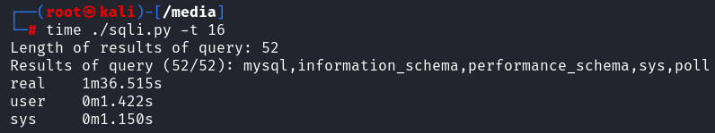

# ExtremeHacking WebPoll SQLi PoC
This repository contains an script that automates the exploitation of a second-order AND boolean-based blind SQL injection found on the challenge WebPoll created by [Extreme Hacking](https://app.extremehacking.io).

# Requirements
This has been developed and tested in Python 3.11.6, on Kali Linux.

# Setup and Usage
1. Clone this repository
`git clone https://github.com/dsantos-1/ExtremeHacking_WebPoll_SQLi_PoC`
2. Open the script sqli.py and input the target IP address on the variables `submit_poll_url` and `get_poll_url`
3. Choose the desired payload in the functions `get_query_length` and `get_query_char` (by default, this script extracts the names from all databases)
5. Make the script executable
`chmod +x sqli.py`
6. Run the script
`./sqli.py [-t <number of threads, up to 16>]`

# Example

